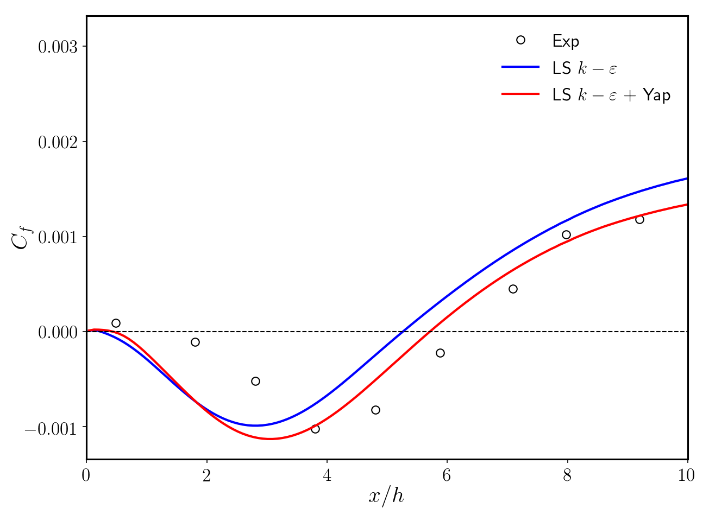
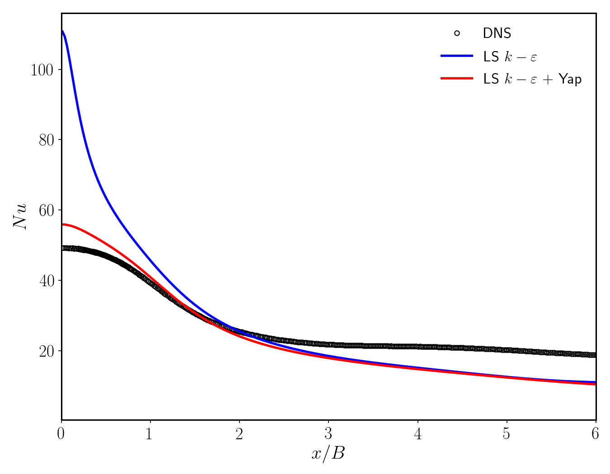

# LaunderSharmaKEYap

The so-called [Yap correction](https://ethos.bl.uk/OrderDetails.do?uin=uk.bl.ethos.384178) has been added to the [Launder and Sharma](https://www.sciencedirect.com/science/article/pii/0094454874901507) low-Re  (referred to LS  henceforth) as implemented in OpenFOAM v6.1, with the aim to improve its performance in recirculating and impinging flows.

The LS  is a very popular low-Re turbulence model based on damping functions; this allows for the integration of the turbulent equations up to the wall and avoid the use of wall functions. Similarly to all the -based turbulence models, the LS  tends to greatly overpredict the turbulent length scale in non-equilibrium situations such as those found in detachment, reattachment and impinging regions.

The Yap correction consists in an additional source term added to the transport equation of . The source term has the form:

where  is the turbulent lengthscale at equilibrium,  is the von Karman constant and  is the wall distance. The Yap correction tends to reduce the excessive departure from the equilibrium lengthscale typical of  models in non-equilibrium flows. When the predicted lengthscale is greater than the equilibrium value, the source term tends to increase the value of the dissipation rate, therefore reducing the value of the calculated lengthscale and bringing it closer to its equilibrium value. The correction is only active in non-equilibrium regions and close to solid walls, and has essentially no impact on the other regions of the flow.

This implementation of the Yap correction has been tested in a [backward facing step](https://arc.aiaa.org/doi/10.2514/3.8890) and in a [planar impinging jet](https://www.sciencedirect.com/science/article/pii/S0306454919300465) cases. The skin friction coefficient obtained for the backward facing step (left) and the Nusselt number calculated for the impinging jet (right) with the standard LS model and the LS+Yap correction are displayed below.

 

It can be seen that the improvements obtained with the Yap correction compared to the standard LS model are dramatic, especially in the impinging jet case. Since recirculating and impinging flows are ubiquitous in industry, the Yap correction is a simple and effective way to improve the performance of the standard  formulation in these cases.